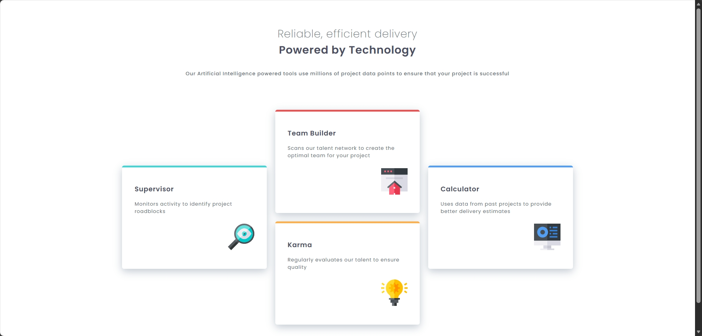

# Frontend Mentor - Four card feature section solution

This is a solution to the [Four card feature section challenge on Frontend Mentor](https://www.frontendmentor.io/challenges/four-card-feature-section-weK1eFYK). Frontend Mentor challenges help you improve your coding skills by building realistic projects.

## Table of contents

- [Overview](#overview)
  - [The challenge](#the-challenge)
  - [Screenshot](#screenshot)
  - [Links](#links)
- [My process](#my-process)
  - [Built with](#built-with)
  - [What I learned](#what-i-learned)
- [Author](#author)

**Note: Delete this note and update the table of contents based on what sections you keep.**

## Overview

### The challenge

Users should be able to:

- View the optimal layout for the site depending on their device's screen size

### Screenshot



### Links

- Solution URL: [solution URL here](https://github.com/GraceRosario/four-card-feature-section)
- Live Site URL: [live site URL here](https://gracerosario.github.io/four-card-feature-section/)

## My process

### Built with

- Semantic HTML5 markup
- CSS custom properties
- Flexbox
- CSS Grid
- Mobile-first workflow

### What I learned

i learned how to make responsive layouts with grid. first of all, to use grid we have to use

```css
.cards-container {
  display: grid;
}
```

on main container, then we need to define columns and rows

```css
.cards-container {
  grid-template-columns: repeat(3, minmax(auto, 350px));
  grid-template-rows: repeat(2, 1fr);
}
```

then, to center .supervisor and .calculator in there columns, we need

```css
.claculator,
.supervisor {
  grid-row: 1 / span 2;
  height: auto;
}
```

usually this stretches the whole card from start of row one to the end of row two but because of height auto, it will nicely take space on center alone

for example:-

```html
<div class="cards-container">
  <article class="card supervisor">
    <h1>Supervisor</h1>
    <p>Monitors activity to identify project roadblocks</p>
    
  </article>

  <article class="card team-builder">
    <h1>Team Builder</h1>
    <p>Scans our talent network to create the optimal team for your project</p>
    
  </article>

  <article class="card karma">
    <h1>Karma</h1>
    <p>Regularly evaluates our talent to ensure quality</p>
    
  </article>

  <article class="card calculator">
    <h1>Calculator</h1>
    <p>Uses data from past projects to provide better delivery estimates</p>
    
  </article>
</div>
```

```css
.sub-heading,
.main-heading {
  font-size: 1.625rem;
}

.card {
  max-width: 350px;
}

.cards-container {
  width: auto;
  padding: 3rem;
  display: grid;
  gap: 20px;
  grid-template-columns: repeat(3, minmax(auto, 350px));
  grid-template-rows: repeat(2, 1fr);
  align-items: center; /* This is the "magic" that replaces your 140px */
  place-content: center;
}

.supervisor {
  grid-column: 1;
  height: auto;
  grid-row: 1 / span 2;
}

.karma {
  grid-column: 2;
}

.calculator {
  grid-column: 3;
  height: auto;
  grid-row: 1 / span 2;
}
```

## Author

- Frontend Mentor - [@GraceRosario](https://www.frontendmentor.io/profile/GraceRosario)
